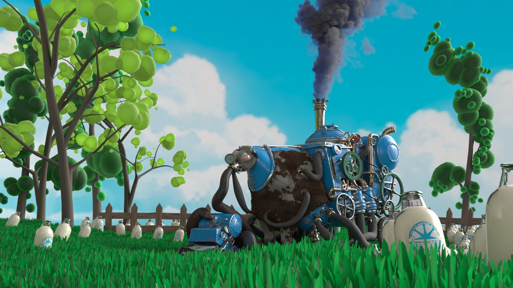

# MachineFlesh - An openUSD Scene.

-------------------------------------------------------------------------------------------------------------------------------------
The project is designed for a single static scene, with a focus on portability, ease of understanding, and ease of modification, making it an excellent resource for those new to openUSD or the ones who are looking for an openUSD toy to play with in their DCC of choice.

The scene (which undoubtedly has a very dark and uncomfortable theme) was originally created about 20 years ago for a CGTalk forum challenge and it was awarded the second runner prize. It is remastered with new UVs and Textures, cleaned-up geometries and new, USD-based scattering techniques. 
-------------------------------------------------------------------------------------------------------------------------------------

_license: This work is licensed under Creative Commons Attribution-ShareAlike 4.0 International License._
